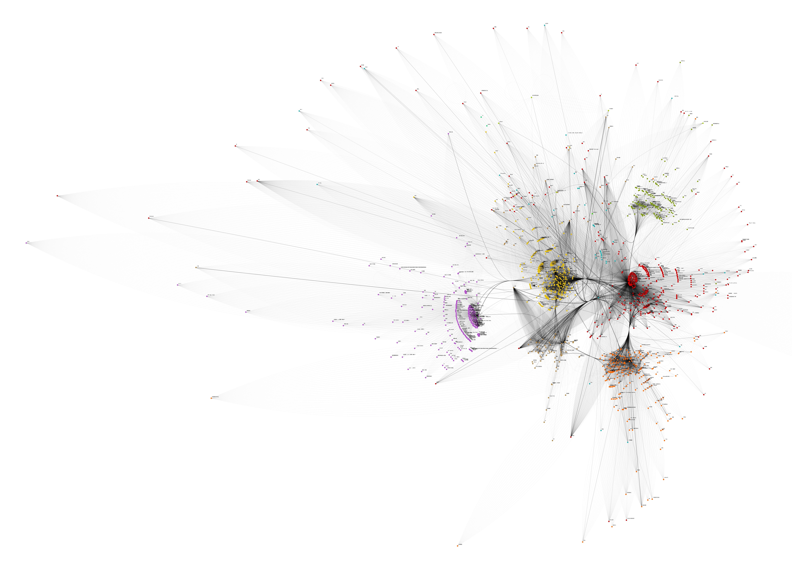
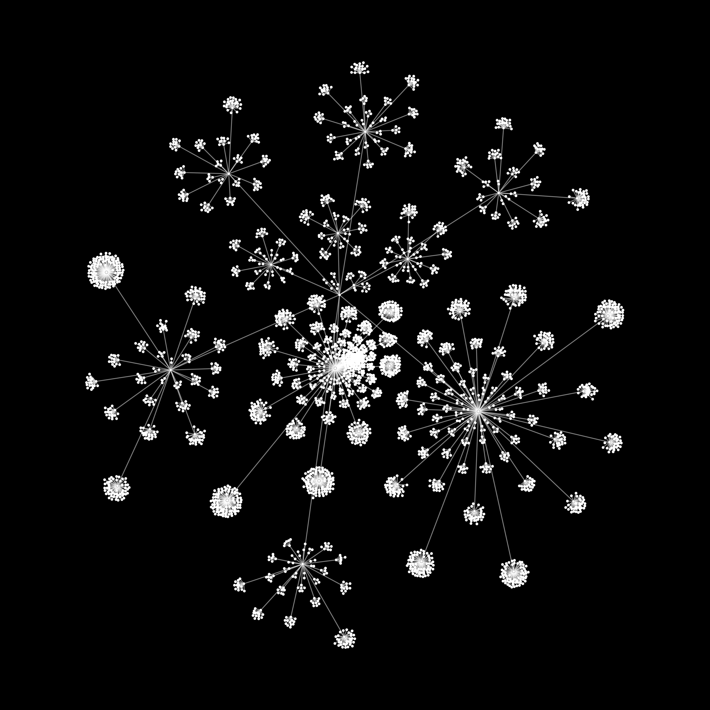
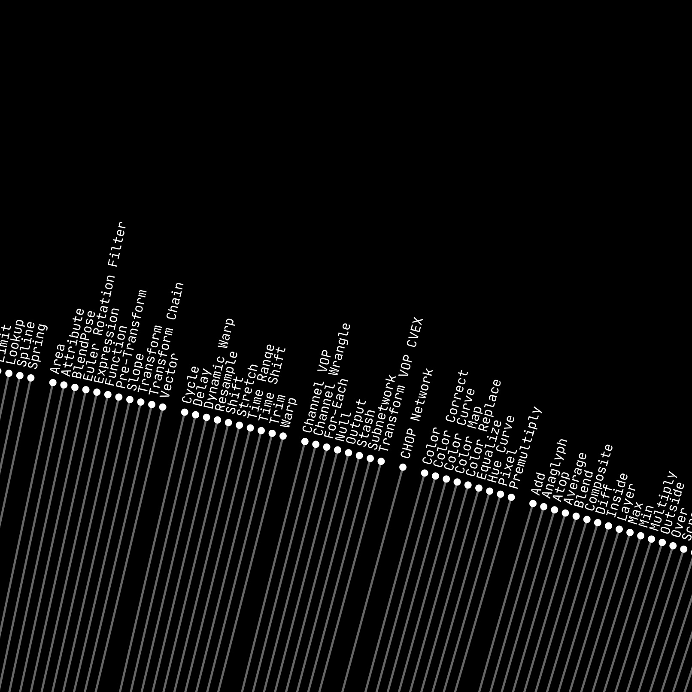

# social-vis


## WeChat Memory Like Relationship Vis

### Data Crawl

> TBD.

### Data Struct (Example)

```json
{
  "isCurrentUser": false,
  "snsId": "...",
  "authorName": "...",
  "authorId": "...",
  "content": "...",
  "comments": [],
  "likes": [
    {
      "isCurrentUser": false,
      "userName": "...",
      "userId": "..."
    }
  ],
  "mediaList": [
    "http://..."
  ],
  "rawXML": "...",
  "timestamp": 1569122476
}
```

### Data Process

```mathematica
gr = Flatten[
   Table[Table[
     UndirectedEdge[dataset[j, 7, "likes", All, "userName"][i], 
      dataset[j, 3, "authorName"]], {i, 1, 
      Length[dataset[j, 7, "likes"]]}], {j, 1, 7418}]];
```

### Variation 1


```mathematica
style = {EdgeStyle -> 
    Directive[Opacity[.05], Black, Thickness -> 0.00001], 
   Background -> White, EdgeShapeFunction -> (Line[#1] &), 
   ImageSize -> 30000};
CommunityGraphPlot[gr, style]
```

### Variation 2



```mathematica
style = {EdgeStyle -> Directive[Opacity[.05], Black, Thickness -> 0.0001], ImageSize -> 3000};
graph = CommunityGraphPlot[gr,CommunityBoundaryStyle -> None, style, 
  VertexLabels -> "Name", 
  VertexLabelStyle -> Directive[Black, Opacity[1], 2]]
```


## Houdini Node Vis

```python
import hou
import json

data = []

tools = hou.shelves.tools()

for node_category in hou.nodeTypeCategories().values():
    category_name = node_category.name()

    node_types = node_category.nodeTypes()

    for node_type in node_types.values():
        default_tool_name = hou.shelves.defaultToolName(
            category_name,
            node_type.name()
        )
        node_tool = tools.get(default_tool_name.lower())

        node_data = {}
        node_data["category"] = category_name
        node_data["name"] = node_type.name()
        node_data["nameComponents"] = node_type.nameComponents()
        node_data["description"] = node_type.description()

        if node_tool:
            node_data["toolMenuLocations"] = node_tool.toolMenuLocations()
            node_data["toolLabel"] = node_tool.label()

        data.append(node_data)


with open('/Users/ciaochaos/Downloads/houdini_data.json', 'w') as file:
    file.write(json.dumps(data, indent=4))
```







